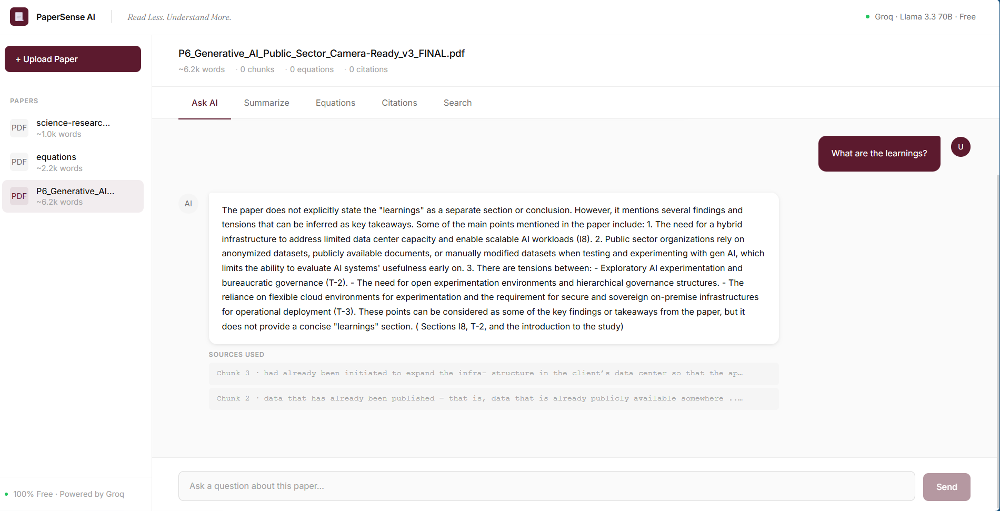
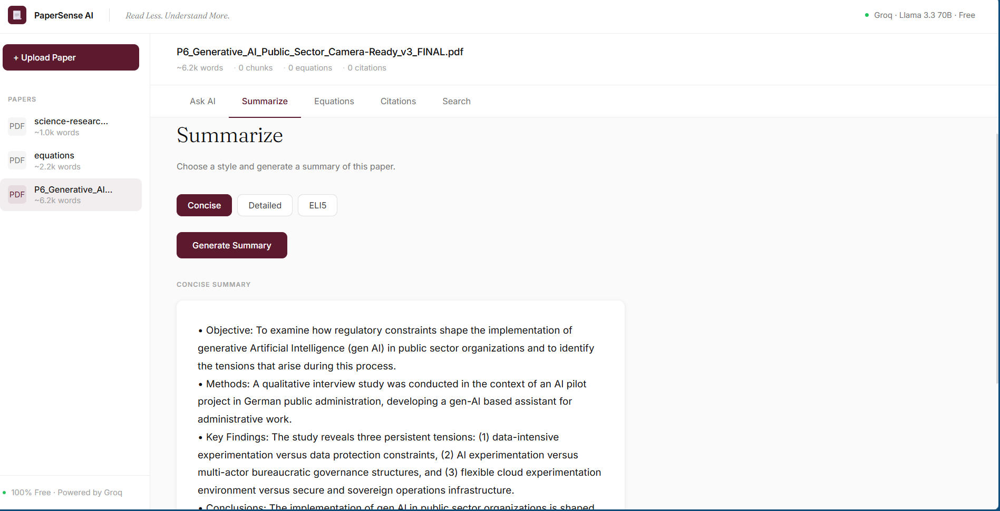
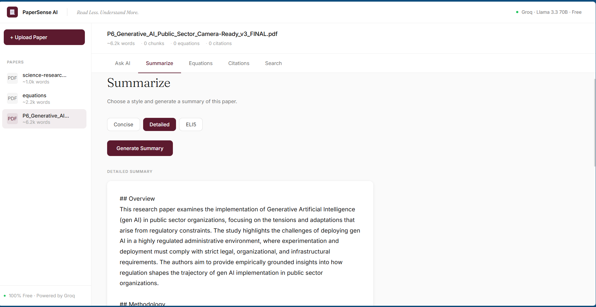
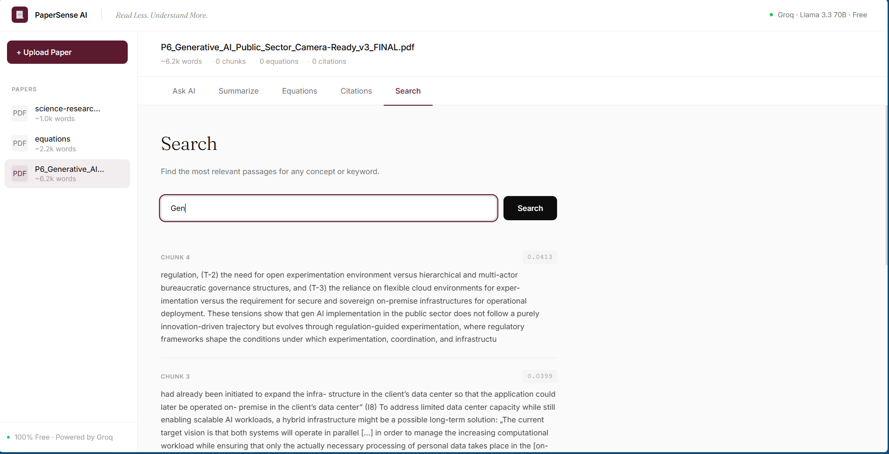
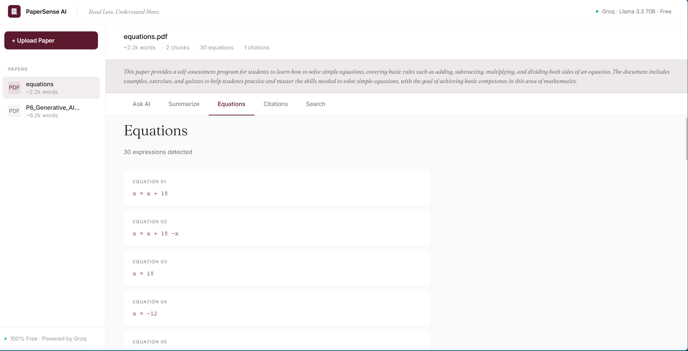
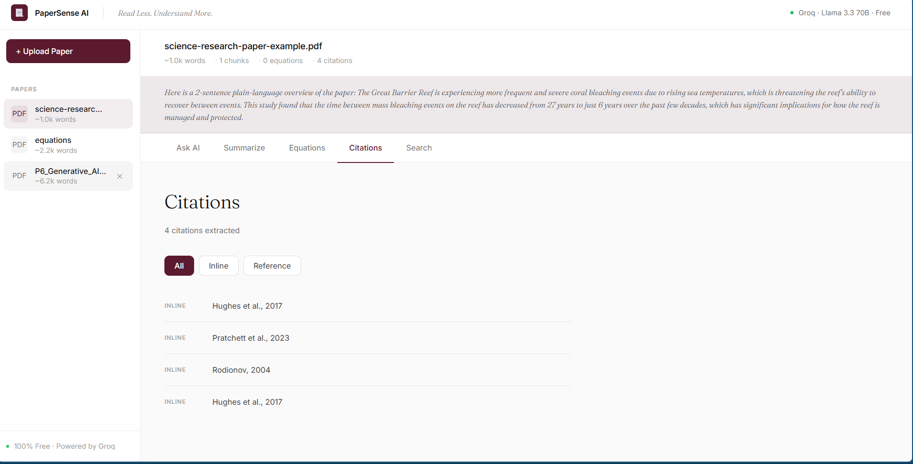

<div align="center">

# PaperSense AI — Research Paper Intelligence Platform

Full-stack AI research assistant featuring **Q&A chat**, **smart summarization**, **equation extraction**, **citation tracing**, and **semantic search** — all powered by a free LLM.

Built with **Python + FastAPI** and **React 18**, focused on academic paper comprehension, knowledge extraction, and AI-assisted research workflows.


</div>

---

## Features

* **Q&A Chat** — Ask anything about a paper; answers grounded in actual content via RAG pipeline
* **Smart Summarization** — Three distinct styles: concise bullets, structured academic report, plain-language ELI5
* **Equation Extraction** — Automatically surfaces all mathematical expressions and LaTeX from PDFs
* **Citation Tracing** — Extracts inline citations and full reference lists with type classification
* **Semantic Search** — Finds the most relevant passages for any concept, term, or keyword
* **Auto Quick-Summary** — 2-sentence plain-language overview generated on every upload
* **Multi-Paper Library** — Upload and switch between multiple papers in one session
* **Input Validation** — Handles non-PDF uploads, corrupt files, missing API keys, and backend errors
* **Responsive Dashboard UI** — Clean SaaS-style interface with real-time AI feedback
* **100% Free AI** — Powered by Groq Cloud + Llama 3.3 70B, no credit card required

---

## Screenshots

### Research Assistant



---

### Concise Summary



---

### Detailed Summary



---

### ELI5 Summary


---

### Semantic Search



---

### Equation Extractor



---

### Citation Explorer


---

## Core Modules

### Q&A Chat

Features:

* Context-grounded answers via RAG pipeline
* Top-4 most relevant chunk retrieval per question
* Source chunk attribution shown per answer
* Full chat history within session
* Typing indicator during AI generation

---

### Smart Summarization

Three fully distinct output styles:

* **Concise** — Exactly 5 bullet points: Objective · Methods · Key Findings · Conclusions · Implications
* **Detailed** — Structured academic report with sections: Overview · Methodology · Key Findings · Limitations · Future Work
* **ELI5** — 3 plain-language paragraphs for a curious 15-year-old, no jargon, real-world analogies

Auto-summary also generated on every upload.

---

### Equation Extraction

Detects:

* Inline LaTeX expressions `$...$`
* Display math blocks `$$...$$`
* LaTeX equation environments
* Plain-text mathematical expressions
* Up to 30 unique equations per paper

---

### Citation Tracing

Extracts:

* Inline numbered citations `[1]`, `[2]`
* Author-year citations `(Smith, 2020)`
* Full reference list entries
* Inline vs. reference type classification
* Up to 50 citations per paper

---

### Semantic Search

Provides:

* Keyword-overlap cosine similarity ranking
* Top-5 most relevant passage retrieval
* Chunk index and relevance score per result
* Full passage preview per result

---

## Full Processing Pipeline

```text
PDF Upload
      ↓
File Validation (PDF check, size guard)
      ↓
PyMuPDF Text + Metadata Extraction
      ↓
Overlapping Chunk Splitting (1500 words, 200-word overlap)
      ↓
Equation Extraction (regex: LaTeX + plain math)
      ↓
Citation Extraction (regex: numbered + author-year + reference list)
      ↓
Groq Quick-Summary (Llama 3.3 70B)
      ↓
Paper stored in memory — ready for Q&A, Search, Analysis
```

---

## Tech Stack

| Layer        | Technology                  |
|--------------|-----------------------------|
| Backend      | Python 3.8+                 |
| Framework    | FastAPI 0.111               |
| AI Provider  | Groq Cloud (free)           |
| AI Model     | Llama 3.3 70B Versatile     |
| PDF Parsing  | PyMuPDF (fitz)              |
| Env Config   | python-dotenv               |
| Server       | Uvicorn (ASGI)              |
| Frontend     | React 18                    |
| HTTP Client  | Axios                       |
| File Upload  | react-dropzone              |
| Fonts        | Inter + Fraunces (Google)   |
| Architecture | Modular RAG pipeline        |

---

## Project Structure

```bash
papersense-ai/
├── start.sh                         ← One-command launcher (both services)
├── README.md
├── .env.example
│
├── backend/
│   ├── main.py                      ← FastAPI: 8 REST routes, PDF processing, Groq AI
│   ├── requirements.txt             ← Python dependencies
│   ├── .env.example                 ← API key template
│   └── README.md                    ← Backend docs + upgrade path
│
└── frontend/
    ├── package.json                 ← React 18 deps + proxy config
    ├── public/
    │   └── index.html
    └── src/
        ├── App.js                   ← Root layout, routing, state orchestration
        ├── App.css                  ← Full design system (tokens, all components)
        ├── index.js                 ← ReactDOM entry point
        ├── components/
        │   ├── Sidebar.js           ← Navigation panel + paper library
        │   ├── UploadZone.js        ← Drag-and-drop PDF uploader
        │   └── PaperWorkspace.js    ← 5-tab analysis workspace
        ├── hooks/
        │   ├── useApi.js            ← Generic async API hook (loading/error/data)
        │   └── usePapers.js         ← Paper list state management
        ├── pages/
        │   ├── HomePage.js          ← Landing + upload page
        │   └── WorkspacePage.js     ← Paper analysis page
        └── utils/
            └── api.js               ← Axios wrappers for all 8 endpoints
```

---

## API Endpoints

| Method   | Endpoint              | Description                           |
|----------|-----------------------|---------------------------------------|
| `POST`   | `/upload`             | Upload and process a PDF              |
| `GET`    | `/papers`             | List all uploaded papers              |
| `POST`   | `/ask`                | Ask AI a question about a paper       |
| `POST`   | `/summarize`          | Summarize (concise / detailed / eli5) |
| `GET`    | `/equations/{id}`     | Extract equations from a paper        |
| `GET`    | `/citations/{id}`     | Extract citations from a paper        |
| `POST`   | `/search`             | Semantic keyword search               |
| `DELETE` | `/papers/{id}`        | Delete a paper from memory            |

Swagger UI auto-generated at `http://localhost:8000/docs`

---

## Getting Started

### Prerequisites

* Python 3.8+
* Node.js 18+
* pip
* Free Groq API key → [console.groq.com](https://console.groq.com) *(no credit card)*

### Installation

```bash
# 1. Clone the repository
git clone https://github.com/YOUR_USERNAME/papersense-ai.git

# 2. Enter project directory
cd papersense-ai

# 3. Create backend/.env with your free Groq key
#    File content:  GROQ_API_KEY=gsk_your_key_here

# 4. Install backend dependencies
cd backend
pip install -r requirements.txt

# 5. Install frontend dependencies
cd ../frontend
npm install
```

---

## Run Application

### Option A — One command

```bash
bash start.sh
```

### Option B — Two terminals

```bash
# Terminal 1 — Backend
cd backend
python main.py
# → API at http://localhost:8000
# → Swagger at http://localhost:8000/docs

# Terminal 2 — Frontend
cd frontend
npm start
# → App at http://localhost:3000
```

---

## Free AI — Groq + Llama 3.3 70B

| Property         | Value                        |
|------------------|------------------------------|
| Provider         | Groq Cloud                   |
| Model            | `llama-3.3-70b-versatile`    |
| Free daily limit | 14,400 requests / day        |
| Speed            | 300–800 tokens / second      |
| Credit card      | Not required                 |
| Sign up          | https://console.groq.com     |

Swapping to a paid provider (OpenAI, Anthropic) is a 2-line change — the backend uses the OpenAI-compatible SDK interface.

---

## Technical Highlights

### RAG Pipeline

Chunks each uploaded PDF into 1500-word overlapping segments, scores them against the user's query via cosine keyword similarity, and feeds the top-4 chunks to Llama 3.3 70B for context-grounded answers.

### Distinct Summarization Styles

Each style uses a different prompt structure — concise outputs strict bullet points, detailed outputs structured academic sections, ELI5 outputs conversational prose. The model is instructed explicitly on format, not just tone.

### Zero External Vector DB

Semantic search runs entirely on in-memory keyword similarity — no ChromaDB or Pinecone needed for the MVP. Drop-in replaceable with real embeddings for production.

### Validation Layer

Prevents non-PDF uploads, missing API key crashes, malformed paper ID requests, and empty document processing — all errors surface cleanly in the UI.

---

## Concepts Demonstrated

* Retrieval-Augmented Generation (RAG)
* Large Language Model Integration
* Prompt Engineering (style-specific output formatting)
* PDF Text Extraction and Processing
* Overlapping Chunk Splitting Strategy
* Cosine Similarity Semantic Search
* Async FastAPI Backend Engineering
* Modular React Component Architecture
* Custom React Hook Design Patterns
* REST API Design with Pydantic Validation
* Full-Stack AI Application Development

---

## Future Improvements

* ChromaDB / Pinecone vector store with real embeddings
* Multi-paper cross-reference Q&A
* LangChain RAG pipeline integration
* Ollama local LLM support (offline mode)
* Exportable PDF summary reports
* User authentication + persistent paper library
* Docker deployment
* OS fingerprinting + CVE lookup for security research papers

---

## Legal Disclaimer

Only upload papers you own, have authored, or have explicit rights to process.

Respect copyright and institutional data policies when using this tool with proprietary or licensed research.

---

## License

MIT © Manya Singh
